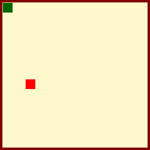

# Jogo Captura-de-Pontos

Seja Bem Vindo(a)!

## Regras do Jogo

Em 'Captura de Pontos', você assume o papel de um ponto branco em busca de emoção e velocidade. Seu objetivo é capturar pontos que surgem aleatoriamente pelo cenário. À medida que você captura esses pontos, sua velocidade aumenta, proporcionando um desafio cada vez maior. Você precisará demonstrar agilidade e precisão para evoluir no jogo. Conforme acumula pontos, a adrenalina aumenta, e a competição se intensifica!

# <a href="https://carloseduts.github.io/Jogo-Captura-de-Pontos/">Clique aqui para Jogar! </a>
# Jogo-Captura-de-Pontos
